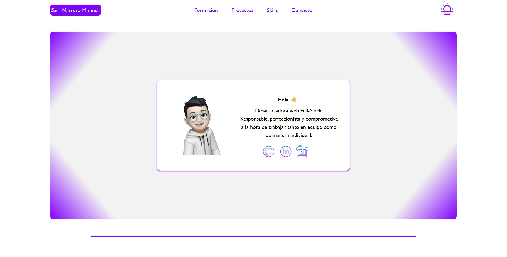

# Web Personal
Este es un pequeño proyecto que muestra un poco de mí, algunos de los proyectos que he realizado, mis conocimientos en el desarrollo web, enlaces a mis redes sociales y a github, un enlace para descargar mi curriculum de manera directa y un pequeño formulario por si alguién desea ponerse en contacto conmigo.

# 📸 Página principal

# 🪛Tecnologías
Para llevar a cabo la realización de este proyecto, he utilizado:
* HTML
* CSS
* JavaScript
* Tailwind
* Ajax
* Github

# 👩🏻‍💻Autora
* Sara Marrero Miranda
